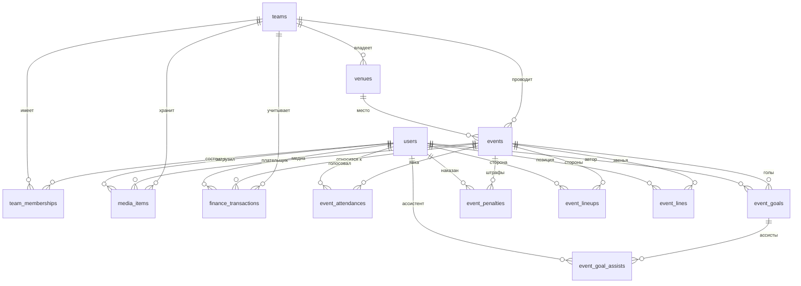

# SportyHockey — Architecture

Обновлено: 2026-05-21 (после итерации 18). Документ — единая e2e-карта приложения: что → откуда → как.

## Содержание

1. [Стек](#1-стек)
2. [Бот](#2-что-такое-бот-в-нашем-контексте)
3. [Поток авторизации](#3-поток-авторизации)
4. [Структура проекта](#4-структура-проекта)
5. [E2E-карта: экран → хук → API → таблица](#5-e2e-карта-экран--хук--api--таблица)
6. [API endpoints](#6-api-endpoints--полный-список)
7. [Хуки клиента](#7-хуки-клиента-tanstack-query--мутации)
8. [Модель данных](#8-модель-данных)
9. [TanStack Query: кэш и инвалидация](#9-tanstack-query-кэш-и-инвалидация)
10. [Принципы и запреты](#10-принципы-и-запреты)
11. [Безопасность](#11-безопасность)

---

## 1. Стек

| Слой               | Технология                                | Назначение                                                          |
| ------------------ | ----------------------------------------- | ------------------------------------------------------------------- |
| Frontend + Backend | Next.js 16 (App Router) + React 19 + TS   | Mini App страницы + API routes в одном проекте                      |
| TMA SDK            | `@telegram-apps/sdk-react`                | `initData`, theme, кнопки `BackButton` / `MainButton`               |
| UI state           | Zustand                                   | Локальный UI-стейт                                                  |
| Server state       | TanStack Query v5                         | Кеш fetch к `/api/*`, инвалидация                                   |
| DB                 | Supabase Postgres 17                      | Реляционные сущности, миграции                                      |
| Storage            | Supabase Storage (bucket `team-media`)    | Медиа: путь `{team_id}/{event_id}/{uuid}.{ext}`                     |
| Bot                | grammy в `/api/bot/route.ts`              | Webhook от Telegram: команды, callback-кнопки голосования, пуши     |
| Auth               | Telegram `initData` (HMAC на сервере)     | Каждый `/api/*` запрос несёт `initData`; никаких JWT/cookies/сессий |
| Hosting            | Vercel                                    | Next.js + Vercel Cron                                               |

## 2. Что такое бот в нашем контексте

Это тот же `@sporty_hockey_bot`, к которому привязан Mini App в @BotFather. Он делает три вещи:

1. Принимает сообщения (`/start`, `/events`).
2. Принимает нажатия inline-кнопок (callback queries) — голоса.
3. Шлёт сообщения пользователям через Telegram Bot API.

Технически: Telegram POST'ит апдейты на `/api/bot`. Мы парсим и отвечаем. **grammy** — лёгкая библиотека (5 КБ), помогает с типами, роутингом команд и сборкой inline-клавиатур.

## 3. Поток авторизации

1. Mini App открывается → TG SDK даёт `window.Telegram.WebApp.initData` (подписан серверами Telegram).
2. Фронт прикладывает `Authorization: tma <initData>` к каждому fetch'у на `/api/*` (через [api-client.ts](../src/lib/api-client.ts)).
3. Сервер в `requireUser()` валидирует HMAC через `BOT_TOKEN`, парсит `user`, upsert'ит в `users`, возвращает `user_id`.
4. Для мутаций используется `requireOrganizer(request)` — возвращает user + team_id, где он organizer. На PoC: один user — одна команда (берётся первая `organizer`-membership). API routes дополнительно сверяют `event.team_id === ctx.team_id`.

`initData` — это и есть сессия. Никаких JWT/cookies/refresh-токенов.

## 4. Структура проекта

```
SportyHockey/
├── src/
│   ├── app/
│   │   ├── (tabs)/                       # 5 Mini App страниц под общим layout с BottomNav
│   │   │   ├── layout.tsx
│   │   │   ├── page.tsx                  # /                           главная (placeholder)
│   │   │   ├── events/page.tsx           # /events                     расписание
│   │   │   ├── events/new/page.tsx       # /events/new                 создание события
│   │   │   ├── events/[id]/page.tsx      # /events/[id]                детали события
│   │   │   ├── events/[id]/attendees/    # /events/[id]/attendees      участники и взносы
│   │   │   ├── events/[id]/lineup/       # /events/[id]/lineup         состав/звенья
│   │   │   ├── events/[id]/media/        # /events/[id]/media          фотогалерея
│   │   │   ├── events/[id]/reschedule/   # /events/[id]/reschedule     перенос
│   │   │   ├── events/[id]/cancel/       # /events/[id]/cancel         отмена
│   │   │   ├── events/[id]/result/       # /events/[id]/result         результат и статистика
│   │   │   ├── squad/page.tsx            # /squad                      состав команды
│   │   │   ├── money/page.tsx            # /money                      финансы (placeholder)
│   │   │   └── profile/page.tsx          # /profile                    профиль
│   │   ├── onboarding/page.tsx           # /onboarding                 без BottomNav, создание команды
│   │   ├── api/                          # см. раздел 6
│   │   ├── layout.tsx                    # root + lang=ru + viewport
│   │   ├── providers.tsx                 # TG SDK init + TanStack Query Provider
│   │   └── globals.css
│   ├── components/                       # UI-кит (см. раздел 4.1)
│   ├── hooks/                            # см. раздел 7
│   ├── lib/
│   │   ├── supabase-server.ts            # service-role клиент (server-only)
│   │   ├── telegram-verify.ts            # HMAC validate initData
│   │   ├── auth.ts                       # requireUser / requireOrganizer / AuthError
│   │   ├── bot.ts                        # grammy Bot + handlers (deeplink /start team_<uuid>)
│   │   ├── team-link.ts                  # buildInviteLink(teamId)
│   │   ├── user-team.ts                  # getUserTeamId(userId)
│   │   ├── role.ts                       # asMemberRole
│   │   ├── format-name.ts                # formatName({first,last,username})
│   │   ├── format-time.ts                # formatMatchTime / parseMatchTime
│   │   ├── event-enum.ts                 # asEventType / asEventStatus
│   │   ├── event-attendance.ts           # loadAttendance(events) → счётчики
│   │   ├── event-format.ts               # форматирование событий для UI
│   │   ├── event-lines.ts                # хелперы линий и позиций
│   │   ├── event-result.ts               # asResultSide / sidesForEventType
│   │   ├── share-result.ts               # buildShareText / shareEventImage
│   │   ├── notify.ts                     # заглушки рассылок (12.x)
│   │   └── api-client.ts                 # типизированный fetch + apiFetchBlob
│   ├── theme/                            # colors / spacing / typography / radius
│   ├── types/                            # db.ts (сгенерённый) + api.ts (локальные)
│   └── i18n/ru.ts                        # плоский dict ключ → строка
├── supabase/
│   └── migrations/                       # SQL миграции
├── docs/
│   ├── ARCHITECTURE.md                   # этот файл
│   ├── BEST_PRACTICES.md
│   ├── DESIGN.md
│   ├── PRODUCT_BRIEF.md
│   ├── ROADMAP.md
│   ├── features/<эпик>.md
│   └── roadmap/v0.X.md
├── scripts/set-webhook.mjs               # pnpm set-webhook <url>
├── next.config.ts
└── package.json
```

### 4.1 Компоненты `src/components/`

| Группа              | Компоненты                                                                                |
| ------------------- | ----------------------------------------------------------------------------------------- |
| Layout / контейнеры | `screen.tsx`, `bottom-nav.tsx`, `bottom-sheet.tsx`, `card.tsx`, `section-header.tsx`      |
| Хедеры              | `dark-header.tsx`, `light-header.tsx`, `back-button.tsx`                                  |
| Кнопки              | `button.tsx`, `glass-button.tsx`, `fab.tsx`, `round-icon-button.tsx`, `action-tile.tsx`   |
| Формы               | `input.tsx`, `textarea.tsx`, `time-picker.tsx`, `card-field.tsx`                          |
| Списки и строки     | `list-row.tsx`, `day-event-row.tsx`, `player-row.tsx`, `player-stats-row.tsx`             |
| События             | `event-card.tsx`, `event-summary-card.tsx`, `event-info-sheet.tsx`                        |
| Состав              | `roster-card.tsx`, `lineup-chip.tsx`, `lineup-zone.tsx`, `line-slot.tsx`                  |
| Результат           | `score-card.tsx`, `goal-row.tsx`, `penalty-row.tsx`, `match-result-chip.tsx`              |
| Дашборд результата  | `mvp-card.tsx`, `events-timeline.tsx`, `side-comparison.tsx`, `stat-chip.tsx`             |
| Add-/Edit-sheets    | `add-goal-sheet.tsx`, `add-penalty-sheet.tsx`, `payment-sheet.tsx`, `month-sheet.tsx`     |
| Медиа               | `media-grid.tsx`, `media-tile.tsx`, `media-upload-card.tsx`, `media-viewer.tsx`           |
| Атомы               | `avatar.tsx`, `avatar-stack.tsx`, `chip.tsx`, `empty-state.tsx`, `icons.tsx`              |
| Чарты               | `donut.tsx`, `ring-progress.tsx`, `progress-bar.tsx`                                      |
| Навигация           | `content-tabs.tsx`, `filter-chips.tsx`, `type-chips.tsx`, `week-days.tsx`, `week-picker.tsx`, `info-list-card.tsx` |

---

## 5. E2E-карта: экран → хук → API → таблица

### 5.1 Mermaid: высокоуровневая связь

```mermaid
flowchart LR
    subgraph Client[Client / Mini App]
        S1[/events] --> H1[use-events]
        S2[/events/:id] --> H2[use-event]
        S2 --> HR[use-event-result]
        S2 --> HV[use-vote-event]
        S3[/events/:id/attendees] --> H2
        S3 --> HA[use-set-attendance]
        S3 --> HP[use-set-payment]
        S3 --> HPC[use-payment-claim]
        S4[/events/:id/lineup] --> H2
        S4 --> HL[use-set-lineup]
        S4 --> HLN[use-set-line]
        S5[/events/:id/media] --> HM[use-event-media]
        S5 --> HUM[use-upload-media]
        S5 --> HDM[use-delete-media]
        S6[/events/:id/reschedule] --> HUE[use-update-event]
        S6 --> H2
        S6 --> HVN[use-venues]
        S7[/events/:id/cancel] --> HUE
        S8[/events/:id/result] --> H2
        S8 --> HR
        S8 --> HG[use-add-goal/update-goal/delete-goal]
        S8 --> HPN[use-add-penalty/update-penalty/delete-penalty]
        S9[/events/new] --> HVN
        S10[/squad] --> HTM[use-team-members]
        S11[/profile] --> HME[use-me]
        S12[/onboarding] --> HME
        Bot[bot deeplink] --> S2
    end

    subgraph API[Next.js /api/*]
        H1 --> A1[/api/events GET]
        H2 --> A2[/api/events/:id GET]
        HR --> AR[/api/events/:id/result GET]
        HV --> AV[/api/attendance/vote POST]
        HA --> AA[/api/events/:id/attendance POST]
        HP --> AP[/api/events/:id/payment POST]
        HPC --> APC[/api/events/:id/payment-claim POST]
        HL --> AL[/api/events/:id/lineup POST]
        HLN --> ALN[/api/events/:id/line POST]
        HM --> AM[/api/events/:id/media GET]
        HUM --> AMS[/api/events/:id/media/sign POST]
        HUM --> AMP[/api/events/:id/media POST]
        HDM --> AMD[/api/events/:id/media/:mediaId DELETE]
        HUE --> AU[/api/events/:id PATCH]
        HG --> AG[/api/events/:id/goals POST PATCH DELETE]
        HPN --> APN[/api/events/:id/penalties POST PATCH DELETE]
        HVN --> AVN[/api/venues GET]
        HTM --> ATM[/api/teams/me/members GET]
        HME --> AME[/api/me GET]
        S12 --> AT[/api/teams POST]
        S9 --> AC[/api/events POST]
    end

    subgraph DB[Supabase Postgres]
        T1[(events)]
        T2[(event_attendances)]
        T3[(event_goals)]
        T4[(event_goal_assists)]
        T5[(event_penalties)]
        T6[(event_lineups)]
        T7[(event_lines)]
        T8[(finance_transactions)]
        T9[(media_items)]
        T10[(users)]
        T11[(teams)]
        T12[(team_memberships)]
        T13[(venues)]
    end

    A1 --> T1
    A2 --> T1 & T2 & T6 & T7 & T9
    AR --> T1 & T3 & T4 & T5 & T12
    AV --> T2
    AA --> T2
    AP --> T8 & T2
    APC --> T2
    AL --> T7
    ALN --> T6 & T7
    AM --> T9
    AMS --> Storage[(Storage team-media)]
    AMP --> T9
    AMD --> T9 & Storage
    AU --> T1
    AG --> T3 & T4
    APN --> T5
    AVN --> T13
    ATM --> T12 & T10
    AME --> T10 & T12 & T11
    AT --> T11 & T12
    AC --> T1
```

### 5.2 Таблица: экран → хуки

| Экран                                | Хуки данных                                                                                                                       |
| ------------------------------------ | --------------------------------------------------------------------------------------------------------------------------------- |
| `/` (главная)                        | — (placeholder)                                                                                                                   |
| `/events` расписание                 | `useEvents`, `useMe`                                                                                                              |
| `/events/new` создание               | `useVenues`, `useMe`, прямой `POST /api/events`                                                                                   |
| `/events/[id]` детали                | `useEvent`, `useEventResult` (только для игр), `useMe`, `useVoteEvent`                                                            |
| `/events/[id]/attendees` участники   | `useEvent`, `useMe`, `useSetAttendance`, `useSetPayment`, `usePaymentClaim`                                                       |
| `/events/[id]/lineup` состав         | `useEvent`, `useSetLineup`, `useSetLine`                                                                                          |
| `/events/[id]/media` медиа           | `useEvent`, `useEventMedia`, `useUploadMedia`, `useDeleteMedia`, `useMe`                                                          |
| `/events/[id]/reschedule` перенос    | `useEvent`, `useUpdateEvent`, `useVenues`, `useMe`                                                                                |
| `/events/[id]/cancel` отмена         | `useEvent`, `useUpdateEvent`, `useMe`                                                                                             |
| `/events/[id]/result` результат      | `useEvent`, `useEventResult`, `useAddGoal`, `useUpdateGoal`, `useDeleteGoal`, `useAddPenalty`, `useUpdatePenalty`, `useDeletePenalty`, `useMe` |
| `/squad` состав команды              | `useTeamMembers`                                                                                                                  |
| `/money` финансы                     | — (placeholder)                                                                                                                   |
| `/profile`                           | `useMe`                                                                                                                           |
| `/onboarding`                        | `useMe`, прямой `POST /api/teams`                                                                                                 |

---

## 6. API endpoints — полный список

Все эндпоинты валидируют `initData` через `requireUser` (или `requireOrganizer`). Бот — отдельный auth (секретный токен).

### Профиль и команды

| Метод + путь                          | Auth              | Что делает                                                                            | Таблицы (read / write)                       |
| ------------------------------------- | ----------------- | ------------------------------------------------------------------------------------- | -------------------------------------------- |
| `GET /api/me`                         | requireUser       | Профиль текущего пользователя + список команд с ролью                                 | R: users, team_memberships, teams            |
| `POST /api/teams`                     | requireUser       | Создать команду, создатель = organizer                                                | W: teams, team_memberships                   |
| `GET /api/teams/me/members`           | requireUser       | Список членов команды текущего user                                                   | R: team_memberships, users                   |
| `GET /api/venues`                     | requireUser       | Список площадок команды                                                               | R: venues                                    |

### События

| Метод + путь                          | Auth              | Что делает                                                                            | Таблицы (read / write)                       |
| ------------------------------------- | ----------------- | ------------------------------------------------------------------------------------- | -------------------------------------------- |
| `GET /api/events`                     | requireUser       | Список событий команды + счётчики явки                                                | R: events, venues, team_memberships, event_attendances |
| `POST /api/events`                    | requireOrganizer  | Создать событие (training/game)                                                       | W: events                                    |
| `GET /api/events/[id]`                | requireUser       | Полная инфо: участники, lineup, lines, оплаты, медиа-счётчик. Голы и штрафы — отдельно через `/result`. | R: events, team_memberships, users, event_attendances, finance_transactions, event_lineups, event_lines, media_items |
| `PATCH /api/events/[id]`              | requireOrganizer  | Редактировать (тип, время, площадка, цена, статус)                                    | W: events                                    |
| `POST /api/events/[id]/attendance`    | requireOrganizer  | Отметить явку (showed_up)                                                             | W: event_attendances                         |
| `POST /api/attendance/vote`           | requireUser       | Голосование игрока (going / not_going / null)                                         | W: event_attendances                         |

### Платежи

| Метод + путь                          | Auth              | Что делает                                                                            | Таблицы (read / write)                       |
| ------------------------------------- | ----------------- | ------------------------------------------------------------------------------------- | -------------------------------------------- |
| `POST /api/events/[id]/payment`       | requireOrganizer  | Записать платёж игрока за событие                                                     | W: finance_transactions, event_attendances   |
| `POST /api/events/[id]/payment-claim` | requireUser       | Игрок объявляет о неучтённой оплате                                                   | W: event_attendances                         |

### Состав / линии

| Метод + путь                          | Auth              | Что делает                                                                            | Таблицы (read / write)                       |
| ------------------------------------- | ----------------- | ------------------------------------------------------------------------------------- | -------------------------------------------- |
| `POST /api/events/[id]/lineup`        | requireOrganizer  | Присвоить игроку сторону (light/dark или own/opponent)                                | W: event_lineups, event_lines                |
| `POST /api/events/[id]/line`          | requireOrganizer  | Расставить игрока в звено (строка + позиция)                                          | W: event_lines                               |

### Результат и статистика

| Метод + путь                                  | Auth              | Что делает                                                                       | Таблицы (read / write)                       |
| --------------------------------------------- | ----------------- | -------------------------------------------------------------------------------- | -------------------------------------------- |
| `GET /api/events/[id]/result`                 | requireUser       | Голы, штрафы, счёт, статистика игроков своей команды                             | R: events, teams, event_goals, event_goal_assists, event_penalties, team_memberships |
| `POST /api/events/[id]/goals`                 | requireOrganizer  | Создать гол + ассисты                                                            | W: event_goals, event_goal_assists           |
| `PATCH /api/events/[id]/goals/[goalId]`       | requireOrganizer  | Обновить гол (delete+insert ассисты)                                             | W: event_goals, event_goal_assists           |
| `DELETE /api/events/[id]/goals/[goalId]`      | requireOrganizer  | Удалить гол                                                                      | W: event_goals (ассисты — cascade)           |
| `POST /api/events/[id]/penalties`             | requireOrganizer  | Создать удаление                                                                 | W: event_penalties                           |
| `PATCH /api/events/[id]/penalties/[penaltyId]`| requireOrganizer  | Обновить удаление                                                                | W: event_penalties                           |
| `DELETE /api/events/[id]/penalties/[penaltyId]`| requireOrganizer | Удалить удаление                                                                 | W: event_penalties                           |
| `GET /api/events/[id]/share-image`            | requireUser       | OG-изображение результата (PNG 1200×630) через `next/og`                         | R: events, teams, event_goals                |

### Медиа

| Метод + путь                                  | Auth              | Что делает                                                                       | Storage / Таблицы                            |
| --------------------------------------------- | ----------------- | -------------------------------------------------------------------------------- | -------------------------------------------- |
| `GET /api/events/[id]/media`                  | requireUser       | Список медиа события + public URL                                                | R: media_items, users + Storage public URLs  |
| `POST /api/events/[id]/media/sign`            | requireUser       | Signed upload URL для прямой загрузки в Storage                                  | Storage: signed upload URL                   |
| `POST /api/events/[id]/media`                 | requireUser       | Зарегистрировать загруженный файл в БД                                           | W: media_items                               |
| `DELETE /api/events/[id]/media/[mediaId]`     | requireUser       | Удалить (только uploader или organizer)                                          | W: media_items + Storage delete              |

### Бот

| Метод + путь                          | Auth                                  | Что делает                                                                           |
| ------------------------------------- | ------------------------------------- | ------------------------------------------------------------------------------------ |
| `POST /api/bot`                       | `X-Telegram-Bot-Api-Secret-Token`     | grammy webhook: `/start`, deeplinks `team_<uuid>`, callback queries для голосования  |

---

## 7. Хуки клиента (TanStack Query + мутации)

Все хуки — обёртки над `apiFetch` из [api-client.ts](../src/lib/api-client.ts). Query-хуки используют `useQuery`, мутации — `useMutation` с инвалидацией.

### Query-хуки (читают)

| Хук                | Query key                       | Endpoint                       | Где используется                                              |
| ------------------ | ------------------------------- | ------------------------------ | ------------------------------------------------------------- |
| `useMe`            | `['me']`                        | `GET /api/me`                  | events, new, [id], attendees, media, reschedule, cancel, result, profile, onboarding |
| `useEvents`        | `['events']`                    | `GET /api/events`              | events                                                        |
| `useEvent`         | `['event', id]`                 | `GET /api/events/[id]`         | [id], attendees, lineup, media, reschedule, cancel, result    |
| `useEventResult`   | `['event-result', id]`          | `GET /api/events/[id]/result`  | [id] (для счёта), result                                      |
| `useEventMedia`    | `['event-media', id]`           | `GET /api/events/[id]/media`   | media                                                         |
| `useTeamMembers`   | `['team-members']`              | `GET /api/teams/me/members`    | squad, picker'ы в add-goal-sheet / add-penalty-sheet          |
| `useVenues`        | `['venues']`                    | `GET /api/venues`              | new, reschedule                                               |

### Mutation-хуки (пишут + invalidate)

| Хук                  | Endpoint                                              | Invalidates                                    |
| -------------------- | ----------------------------------------------------- | ---------------------------------------------- |
| `useVoteEvent`       | `POST /api/attendance/vote`                           | `['event', id]`, `['events']`                  |
| `useSetAttendance`   | `POST /api/events/[id]/attendance`                    | `['event', id]`                                |
| `useSetPayment`      | `POST /api/events/[id]/payment`                       | `['event', id]`                                |
| `usePaymentClaim`    | `POST /api/events/[id]/payment-claim`                 | `['event', id]`                                |
| `useSetLineup`       | `POST /api/events/[id]/lineup`                        | `['event', id]`                                |
| `useSetLine`         | `POST /api/events/[id]/line`                          | `['event', id]`                                |
| `useUpdateEvent`     | `PATCH /api/events/[id]`                              | `['event', id]`, `['events']`                  |
| `useAddGoal`         | `POST /api/events/[id]/goals`                         | `['event-result', id]`                         |
| `useUpdateGoal`      | `PATCH /api/events/[id]/goals/[goalId]`               | `['event-result', id]`                         |
| `useDeleteGoal`      | `DELETE /api/events/[id]/goals/[goalId]`              | `['event-result', id]`                         |
| `useAddPenalty`      | `POST /api/events/[id]/penalties`                     | `['event-result', id]`                         |
| `useUpdatePenalty`   | `PATCH /api/events/[id]/penalties/[penaltyId]`        | `['event-result', id]`                         |
| `useDeletePenalty`   | `DELETE /api/events/[id]/penalties/[penaltyId]`       | `['event-result', id]`                         |
| `useUploadMedia`     | `POST /api/events/[id]/media/sign` → `POST media`     | `['event-media', id]`, `['event', id]`         |
| `useDeleteMedia`     | `DELETE /api/events/[id]/media/[mediaId]`             | `['event-media', id]`, `['event', id]`         |

### Утилитарные хуки (не для данных)

`use-t`, `use-tg-header`, `use-tg-swipes`, `use-back-button` — Telegram SDK / i18n / навигация.

---

## 8. Модель данных

Актуальное состояние БД (Supabase project `wzwpnwianozcqavfqvht`). RLS выключен на всех таблицах — доступ только через server-side API с service-role.



### Таблицы (13)

| Таблица                | Назначение                                                                              |
| ---------------------- | --------------------------------------------------------------------------------------- |
| `users`                | Профили (1:1 с Telegram-юзером): telegram_id, имена, photo_url, jersey_number, position |
| `teams`                | Команды: name, logo_url                                                                 |
| `team_memberships`     | Роль user в team: organizer / player                                                    |
| `venues`               | Площадки команды                                                                        |
| `events`               | События: type (training/game), starts_at, venue, cost_per_player, status, opponent_name |
| `event_attendances`    | Явка/голос: vote, showed_up, paid_amount, payment_claim                                 |
| `event_lineups`        | Распределение игроков по сторонам (light/dark или own/opponent) на конкретное событие   |
| `event_lines`          | Позиции в звеньях (row + position)                                                      |
| `event_goals`          | Голы: scorer, team_side, time_seconds                                                   |
| `event_goal_assists`   | Ассисты к голу (cascade delete от goal)                                                 |
| `event_penalties`      | Удаления: player, team_side, minutes, time_seconds                                      |
| `finance_transactions` | Платежи: type, amount, event_id                                                         |
| `media_items`          | Фото в Storage: storage_path, dimensions                                                |

Точная схема (типы, constraints, FK) — в [src/types/db.ts](../src/types/db.ts), сгенерированном через `supabase gen types typescript --linked`.

---

## 9. TanStack Query: кэш и инвалидация

### Глобальные defaults ([providers.tsx](../src/app/providers.tsx))

```ts
defaultOptions: {
  queries: {
    retry: 1,
    refetchOnWindowFocus: false,
    staleTime: 30_000,        // 30 секунд
  }
}
```

### Особенности по запросам

| Хук                 | staleTime  | refetchInterval | Заметка                                                       |
| ------------------- | ---------- | --------------- | ------------------------------------------------------------- |
| `useMe`             | 30s        | —               | стабильный профиль                                            |
| `useEvents`         | 30s        | —               | можно поднять до 60s после аккордеона прошедших               |
| `useEvent`          | 30s        | **10_000ms**    | живое обновление явки/счёта на странице события               |
| `useEventResult`    | 30s        | —               |                                                               |
| `useEventMedia`     | 30s        | —               |                                                               |
| `useTeamMembers`    | 30s        | —               | редко меняется, можно поднять                                 |
| `useVenues`         | 30s        | —               | очень редко меняется, можно поднять                           |

`refetchOnWindowFocus: false` — потому что в Telegram WebView события фокуса нестабильны.

---

## 10. Принципы и запреты

### Принципы

1. **Один цикл планирования:** план → ревью → ok/fix → имплементация. Не итерируем многократно.
2. **Все данные — через `/api/*`.** Никогда не вызывать Supabase из React-компонента.
3. **Каждый `/api/*` route** начинается с `requireUser(request)` или `requireOrganizer(request, eventId)`.
4. **Service-role ключ** — только в [supabase-server.ts](../src/lib/supabase-server.ts), server-only.
5. **Типы из БД** генерим: `supabase gen types typescript --linked > src/types/db.ts`.
6. **Runtime-валидация** тел запросов — через `zod`.
7. **Стейт:** серверный → TanStack Query; UI → Zustand; локальный → useState.

### Запреты

- Не пушить в `main` без явного указания.
- Не использовать `any` без `// FIXME:type` и причины.
- Не коммитить секреты (`.env*`, ключи в коде).
- Не делать `git`-операции (`reset --hard`, `push --force`, удаление веток) без подтверждения.
- Не предлагать RN-абстракции или мономорфный фронт на PoC.
- Не закладывать платежи на PoC.
- Не вызывать Supabase напрямую из React-компонентов.
- Не предлагать JWT/cookie-сессии — auth идёт через `initData` в каждом запросе.

---

## 11. Безопасность

- **`requireUser()`** на каждом API route валидирует `initData` через HMAC (`BOT_TOKEN`).
- **`requireOrganizer()`** дополнительно проверяет роль в команде события.
- **Service-role ключ** — только server-side, никогда не уходит в клиентский бандл.
- **Webhook бота** защищён заголовком `X-Telegram-Bot-Api-Secret-Token`.
- **Storage** — приватный bucket `team-media`, отдаётся через signed/public URLs из API.
- **RLS** — выключен на v0.1 (доступ только через server-side с service-role). Включим, если/когда появится прямой доступ к Supabase с клиента.

---

## Где искать детали

- **Эпики:** `docs/features/`
- **Версии:** [ROADMAP.md](ROADMAP.md) + `docs/roadmap/v0.X.md`
- **Дизайн:** [DESIGN.md](DESIGN.md)
- **Best practices:** [BEST_PRACTICES.md](BEST_PRACTICES.md)
